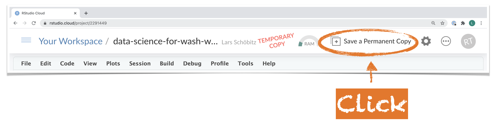

```{r setup, include=FALSE}
options(
  htmltools.dir.version = FALSE,   
  htmltools.preserve.raw = FALSE # to fix HTML issue
  )
knitr::opts_chunk$set(collapse = TRUE,
                      fig.retina = 3)
library(tidyverse)
library(xaringanExtra)
xaringanExtra::use_panelset()
xaringanExtra::use_share_again()
xaringanExtra::style_share_again(
  share_buttons = c("twitter", "linkedin", "pocket")
)

# load packages -----------------------------------------------------------

library(xaringanthemer)

# set options -------------------------------------------------------------

style_mono_accent(
  base_color = "#0F4C81", # Pantone Classic Blue
  header_font_google = google_font("Montserrat"),
  code_font_google = google_font("Fira Mono"), 
  code_font_size = "1.2rem",
  text_font_size = "1.4rem", 
  header_h1_font_size = "2.0rem",
  header_h2_font_size = "1.75rem",
  header_h3_font_size = "1.5rem",
  footnote_font_size = "0.8rem",
  footnote_position_bottom = "20px",
  header_background_padding = "2rem",
  outfile = here::here("slides/assets/css/xaringan-themer.css")
)

# htmttools

library(htmltools)

```

```{r broadcast, echo=FALSE}
xaringanExtra::use_broadcast()
```


class: title-slide

<script async defer data-domain="larnsce.github.io/co-wash-symposium-2021" src="https://plausible.io/js/plausible.js"></script>

# `r rmarkdown::metadata$title`

## `r rmarkdown::metadata$subtitle`

.bottom[

```{r, echo=FALSE}
p(rmarkdown::metadata$author)
p(rmarkdown::metadata$date)
```
]

???
Welcome to this workshop on Data Science for WASH

---
layout: true


---
class: middle

# .big[Welcome! `r emo::ji("wave")`]

---
class: center

.pull-left[

.large[**Lars Schöbitz**]

Environmental Engineer  
WASH Consultant  
Instructor for Data Science with R  

```{r, echo = FALSE, out.width="70%"}

knitr::include_graphics("img/lars_schoebitz_profile_photo.jpg")

```

]

.pull-right[
.large[**Georges Mikhael**]

Senior Urban Sanitation Specialist  
Consultant at Aguaconsult, UK  
Novice R user  

]

???

---
class: middle

## Do you sometimes wonder:

- Where people defecate in the open within a city? And if there are water bodies nearby?
- Who lives downstream of contaminated water bodies? And what the prevalence of diarrhea is in those communities?
- Whether access to safe drinking water decreases the rate of diarrheal disease? 

---
class: middle 

## If so, then you might also wonder:

- How you to use your data, in combination with public open data, to answer these questions
- How you can read, transform and analyse data from different sources, and of different structures


???

- How to prepare a spatial Shit-Flow-Diagram?
- If countries with large amounts of development aid have better health outcomes?
- How one could estimate the number of beneficiaries from faecal sludge management service?

---
class: left
background-image: url(img/starwars-rey-rstats.png)
background-position: middle
background-size: contain


.footnote[Artwork from [@juliesquid](https://twitter.com/juliesquid) for [@openscapes](https://twitter.com/openscapes) (illustrated by [@allison_horst](https://twitter.com/allison_horst)).]


???

- Using open-source (free) tools, you learn how to gather data, intrepret results, and clearly communicate findings.

- You will learn how to clean your data and manage it in a way that makes more productive

- You will learn how to make sense of different kinds of data, how to tell whether something is probably true or not. 

- And you will learn a little bit of statistics and some basic programming skills, but more importantly, will know how to apply both to real-world problems in academia, business and society.

---
class: middle

# Relevance of the topic
***
- Deriving actions from data plays a key role in every organisation
- Demand on WASH professionals to analyse data and share knowledge is increasing
- Little attention given to the resources and competencies needed to satisfy this demand

---
# Data Science - FAQ
***

**Q: What is data science?**  
A: In data science you turn raw data into understanding, insight and knowledge  

**Q: What is R?**  
A: It's a computing language used for data science

**Q: Is Data Science = Statistics**  
A: No, but they are closely related

**Q: Is Data Science = Computer Science**  
A: No, but many themes are shared

---
# Data Science for WASH - FAQ
***
 
**Q: Will I learn how to do machine learning?**  
Nope, not at all. We explore core concepts such as descriptive statistics, data visualisation, and (some) basic modeling

**Q: Do I need any prior experience?**  
A: Nope, my courses are targeted at novice users

**Q: What do I need to learn data science?**  
A: A mindset for openness to change; A good portion of vulnerability; A friendly and open community 

**Q: And how long does it take to learn data science?**  
A: A minimum of 3 months with tutoring support and time effort of 12 hours per week

???

I would say anywhere between 3 months (with tutoring support) up to a year (if someone works along). And it's only step by step that existing workflows can be replaced. But in the long run, learning the basics of how to use code for data analyses will pay off tenfold.

- Q: Do you suggest to replace tools like Akvo Flow or mWater/Solstice? Not at all. They are excellent tools that fulfill a critical need.
- Q: Why then should I invest time into this? To learn critical attributes of a modern analyst. You will develop skillsets, habits, and mindets for working a reproducible and collaborative way
- Q: Isn't this wildly unrealistic? No. Learning data science with R has become much more approachable.


---
class: middle, inverse

# .big[Data Science Lifecycle]

---
class: left
background-image: url(img/data-science-lifecycle/data-science-lifecycle.001.png)
background-position: middle
background-size: contain

---
class: left
background-image: url(img/data-science-lifecycle/data-science-lifecycle.002.png)
background-position: middle
background-size: contain


???
1. First you must import your data into R. This typically means that you take data stored:

- in a file
- in a database, 
- or web application, and load it into R. 

2. If you can’t get your data into R, you can’t do data science on it!

---
class: left
background-image: url(img/data-science-lifecycle/data-science-lifecycle.003.png)
background-position: middle
background-size: contain


???

1. Once you’ve imported your data, it is a good idea to tidy it. 
2. This means to get it into a structure that lets you focus on the questions about your data and not the format it needs to be in
3. In brief: Data is tidy when each column is a variable, and each row is an observations

---
class: left
background-image: url(img/data-science-lifecycle/data-science-lifecycle.004.png)
background-position: middle
background-size: contain

???
1. Once your data is tidy, a common first step is to transform it.
2. This includes 
  - narrowing in on what interests you (like all people without toilets in one district, or all data from last year)
  - creating new variables from existing 
  - calculating summary statistics (like counts or the mean)
  
Together, tidying and transforming are called wrangling, because getting your data in a form that’s natural to work with often feels like a fight!

---
class: left
background-image: url(img/data-science-lifecycle/data-science-lifecycle.005.png)
background-position: middle
background-size: contain

???

- Once you have tidy data with the variables you need, there are two main engines of knowledge generation: visualisation and modelling. 

- These have complementary strengths and weaknesses so any real analysis will iterate between them many times.

Visualisaiton: Visualisation is a fundamentally human activity. A good visualisation will show you things that you did not expect, or raise new questions about the data.

---
class: left
background-image: url(img/data-science-lifecycle/data-science-lifecycle.006.png)
background-position: middle
background-size: contain

???

Models are complementary tools to visualisation. Once you have made your questions sufficiently precise, you can use a model to answer them.


---
class: left
background-image: url(img/data-science-lifecycle/data-science-lifecycle.007.png)
background-position: middle
background-size: contain

???

- The last step of data science is communication, an absolutely critical part of any data analysis project. 

- It doesn’t matter how well your models and visualisation have led you to understand the data unless you can also communicate your results to others.

---
class: middle, inverse

# My data analysis projects
***
## what it used to look like

---
class: left
background-image: url(img/dir-structure.png)
background-position: middle
background-size: contain

---
class: left
background-image: url(img/excel-error.png)
background-position: middle
background-size: contain

---
class: left
background-image: url(img/excel-sheet.png)
background-position: middle
background-size: contain

---
class: inverse, middle

# My data analysis projects
***
## what it looks like now

---
class: left
background-image: url(img/screenshots/screenshots.001.png)
background-size: contain

---
class: left
background-image: url(img/screenshots/screenshots.002.png)
background-size: contain

---
class: left
background-image: url(img/screenshots/screenshots.003.png)
background-size: contain

---
class: left
background-image: url(img/screenshots/screenshots.004.png)
background-size: contain

---
class: left
background-image: url(img/screenshots/screenshots.005.png)
background-size: contain

---
class: left
background-image: url(img/screenshots/screenshots.006.png)
background-size: contain

---
class: left
background-image: url(img/screenshots/screenshots.007.png)
background-size: contain

---
class: inverse, middle

# .large[Let's put work into this workshop]

---
# Requirements
***

1. ~~Registration for Colorado WASH Symposium 2021~~
2. A free account on RStudio Cloud
    - https://rstudio.cloud/plans/free
3. One of Mozilla Firefox, Google Chrome, Microsoft Edge, Safari 
    - just **not** the Internet Explorer
4. A laptop or desktop computer
    - it will be hard to do on a phone or tablet

---
# Screen setup

**Add screenshot that shows setup on one small screen**

---
# Your Turn
***

.large[Step 1: Open this link in your browser]

.big[[kutt.it/cowash-ws](https://kutt.it/cowash-ws)]

.large[Step 2: Create your own permanent project copy]

```{r, echo = FALSE}



```


---
class: inverse, middle

# .big[What's next?]

---
background-image: url(img/r_rollercoaster.png)
background-size: contain 

.footnote[Artwork by [@allison_horst](https://twitter.com/allison_horst)]
---
class: middle

## If you could not follow through the exercises for any reason

- Sign up for another round of this workshop

**TODO: Schedule a Zoom Meeting that people can sign up for**

---
background-image: url(img/welcome_to_rstats_twitter.png)
background-size: contain
background-position: right
class: left

## If you want to continue learning online

- Twitter: #rstats
- Online learning community [@R4DScommunity](https://twitter.com/R4DScommunity)
- Minority R Users [@miR_community](https://twitter.com/miR_community)
- We are [@R-Ladies](https://twitter.com/WeAreRLadies)
- [RStudio Community](https://community.rstudio.com/)

.footnote[Artwork by [@allison_horst](https://twitter.com/allison_horst)]

---
## If you want a complete introduction to R Markdown

### Tutorial by [Danielle Navarro](https://djnavarro.net/)

- Slides: https://slides.djnavarro.net/starting-rmarkdown
- YouTube videos: https://youtube.djnavarro.net/starting-rmarkdown


[
```{r, echo=FALSE, out.width="60%"}

knitr::include_graphics("img/danielle-navarro-markdown.png")

```
](https://slides.djnavarro.net/starting-rmarkdown)

---
class: middle

## If you are interested in following along the development of Data Science for WASH

- Slack: [kutt.it/washdata-slack](https://kutt.it/washdata-slack)
- Twitter: [@washdata](https://twitter.com/washdata)
- E-Mail: Fill out this form **Add link to form**

---
class: middle

## If you have unanswered questions or want to leave a comment (anonymously)

.big[[kutt.it/cowash-gd](https://kutt.it/cowash-gd)]


---
class: middle

# .big[Survey form]

---
class: middle

## We want to learn a bit more about you

- Add Google Form Link


---
# `r emo::ji("sunflower")` Thank you!
***

For joining!

For R packages [{xaringan}](https://github.com/yihui/xaringan) and [{xaringanthemer}](https://github.com/gadenbuie/xaringanthemer), which where used to create these slides.

All material is licensed under [Creative Commons Attribution Share Alike 4.0 International](https://creativecommons.org/licenses/by-sa/4.0/). To download a PDF version of these slides [click here](https://github.com/larnsce/co-wash-symposium-2021/raw/main/docs/slides/co-wash-symposium-data-science-for-wash-slides.pdf).

