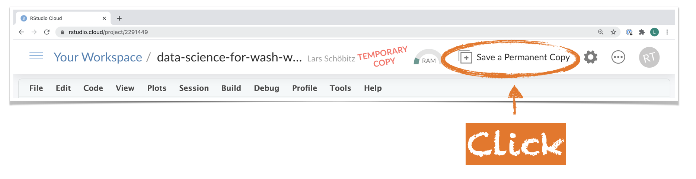

```{r setup, include=FALSE}
options(
  htmltools.dir.version = FALSE,   
  htmltools.preserve.raw = FALSE # to fix HTML issue
  )
# figure height, width, dpi
knitr::opts_chunk$set(echo = FALSE, 
                      warning = FALSE, 
                      eval = TRUE,
                      fig.width = 6, 
                      fig.asp = 0.5,
                      comment = "", 
                      cache = FALSE, 
                      out.width = "100%",
                      fig.align = "center",
                      dpi = 300,
                      message = FALSE)

# ggplot2 set theme
ggplot2::theme_set(ggplot2::theme_gray(base_size = 16))

library(tidyverse)
library(xaringanExtra)
xaringanExtra::use_panelset()
xaringanExtra::use_share_again()
xaringanExtra::style_share_again(
  share_buttons = c("twitter", "linkedin", "pocket")
)

# load packages -----------------------------------------------------------

library(xaringanthemer)
library(palmerpenguins)

# set options -------------------------------------------------------------

style_mono_accent(
  base_color = "#0F4C81", # Pantone Classic Blue
  header_font_google = google_font("Montserrat"),
  code_font_google = google_font("Fira Mono"), 
  code_font_size = "1.2rem",
  text_font_size = "1.4rem", 
  header_h1_font_size = "2.0rem",
  header_h2_font_size = "1.75rem",
  header_h3_font_size = "1.5rem",
  footnote_font_size = "0.8rem",
  footnote_position_bottom = "20px",
  header_background_padding = "2rem",
  outfile = here::here("slides/assets/css/xaringan-themer.css")
)

# htmttools

library(htmltools)

```

```{r broadcast, echo=FALSE}
xaringanExtra::use_broadcast()
```


class: title-slide

<script async defer data-domain="larnsce.github.io/co-wash-symposium-2021" src="https://plausible.io/js/plausible.js"></script>

# `r rmarkdown::metadata$title`

## `r rmarkdown::metadata$subtitle`

.bottom[

```{r, echo=FALSE}
p(rmarkdown::metadata$author)
p(rmarkdown::metadata$date)
p("Colorado WASH Symposium 2021")
p("Slides: kutt.it/cowash2021")
```
]

???
Welcome to this workshop on Data Science for WASH

---
layout: true


---
class: middle

# .big[Welcome! `r emo::ji("wave")`]

---
class: center

.pull-left[

.large[**Lars Schöbitz**]

Environmental Engineer  
WASH Consultant  
Instructor for Data Science with R

```{r, echo = FALSE, out.width="70%"}


```

]

.pull-right[
.large[**Georges Mikhael**]

Senior Urban Sanitation Specialist  
Consultant at Aguaconsult, UK  
Novice R user  

```{r, echo = FALSE, out.width="70%"}


```

]

???

- My name is Lars, I am an environmental engineer and WASH Consultant
- More recently, I have certified as an RStudio Instructor for teaching Data Science with R
- I am leading this workshop and the initative behind it

- Georges is supporting me in this presentation
- He is a Senior Urban Sanitation Specialist at Aguaconsult, UK
- He is a novice R user 
- Today, he will monitor the chat and curate questions for a short discussion at the end

---
class: middle

## Do you sometimes wonder:

- Where people defecate in the open within a city? And if there are water bodies nearby?
- Who lives downstream of contaminated water bodies? And what the prevalence of diarrhea is in those communities?
- Whether access to safe drinking water decreases the rate of diarrheal disease? 

---
class: middle 

## If so, then you might also wonder:

- How to use data visualiation to answer these questions
- How to combine your data with other open data to answer these questions
- How to get data into the right structure to perform different types of analyse

???

- How to prepare a spatial Shit-Flow-Diagram?
- If countries with large amounts of development aid have better health outcomes?
- How one could estimate the number of beneficiaries from faecal sludge management service?

---
class: left
background-image: url(img/starwars-rey-rstats.png)
background-position: middle
background-size: contain


.footnote[Artwork from [@juliesquid](https://twitter.com/juliesquid) for [@openscapes](https://twitter.com/openscapes) (illustrated by [@allison_horst](https://twitter.com/allison_horst)).]


???

- Welcome to Data Science with R

- Using open-source (free) tools, you will learn how to gather data, intrepret results, and clearly communicate findings.

- You will learn how to make sense of different kinds of data, how to tell whether something is probably true or not. 

- You will learn how to manage your data and a little bit of statistics and some basic programming skills, 

- but more importantly, you will know how to apply all that to real-world problems in academia, business and society.

---
class: middle

# Relevance of the topic
***
- Deriving actions from data plays a key role in every organisation
- Demand on WASH professionals to analyse data and share knowledge is increasing
- Little attention given to the resources and competencies needed to satisfy this demand
- Investing now into becoming a data-driven organisation will pay off in the long run

???

So, why is this topic relevant?

---
# Data Science - FAQ
***

**Q: What is data science?**  
A: In data science you turn raw data into understanding, insight and knowledge.  

**Q: What is R?**  
A: It's a computing language used for data science.

**Q: Is Data Science = Statistics?**  
A: No, but they are closely related.

**Q: Is Data Science = Computer Science?**  
A: No, but many themes are shared.

---
# Data Science for WASH - FAQ
***
 
**Q: Will I learn how to do machine learning?**  
Nope, not at all. You will learn core concepts such as descriptive statistics, data visualisation, and (some) basic modeling.

**Q: Do I need any prior experience?**  
A: Nope, my courses are targeted at novice users.

**Q: What do I need to learn data science?**  
A: (1) A mindset for openness to change; (2) A good portion of vulnerability; (3) A friendly and open community.

**Q: And how long does it take to learn data science?**  
A: Three months with tutoring support and a time effort of 12 hours per week. 

???

I would say anywhere between 3 months (with tutoring support) up to a year (if someone works along). And it's only step by step that existing workflows can be replaced. But in the long run, learning the basics of how to use code for data analyses will pay off tenfold.

- Q: Do you suggest to replace tools like Akvo Flow or mWater/Solstice? Not at all. They are excellent tools that fulfill a critical need.
- Q: Why then should I invest time into this? To learn critical attributes of a modern analyst. You will develop skillsets, habits, and mindets for working a reproducible and collaborative way
- Q: Isn't this wildly unrealistic? No. Learning data science with R has become much more approachable.


---
class: middle, inverse

# .big[Data Science Lifecycle]


???
Let's have a look at the data science project lifecycle

---
class: left
background-image: url(img/data-science-lifecycle/data-science-lifecycle.001.png)
background-position: middle
background-size: contain

---
class: left
background-image: url(img/data-science-lifecycle/data-science-lifecycle.002.png)
background-position: middle
background-size: contain


???
1. First you must import your data into R. This typically means that you take data stored:

- in a file
- in a database, 
- or web application, and load it into R. 

2. If you can get your data into R, you can  do data science on it!

---
class: left
background-image: url(img/data-science-lifecycle/data-science-lifecycle.003.png)
background-position: middle
background-size: contain


???

1. Once you’ve imported your data, it is a good idea to tidy it. 
2. This means to get it into a structure that lets you focus on the questions about your data and not the format it needs to be in
3. This is the step where we spend by far the biggest amount of our time. 
4. It has been estimated that we spend about 80% of our time with cleaning and tidying data, so that we can use it fo our analyses.
5. In my courses you will learn how to structure your data in a tidy format as you collect it, and before you import it. A highly underestimated skill.

---
class: left
background-image: url(img/data-science-lifecycle/data-science-lifecycle.004.png)
background-position: middle
background-size: contain

???
1. Once your data is tidy, a common first step is to transform it.
2. This includes 
  - narrowing in on what interests you (like all people without toilets in one district, or all data from last year)
  - creating new variables from existing (like toilet density, as in number of people per toilet) 
  - calculating summary statistics (like counts or the mean)
  
Together, tidying and transforming are called wrangling, because getting your data in a form that’s natural to work with often feels like a fight!

---
class: left
background-image: url(img/data-science-lifecycle/data-science-lifecycle.005.png)
background-position: middle
background-size: contain

???

1. Once you have tidy data with the variables you need, there are two main engines of knowledge generation: 

- visualisation 
- and modelling. 

2. These have complementary strengths and weaknesses so any real analysis will iterate between them many times.

3. Visualisation is a fundamentally human activity. A good visualisation will show you things that you did not expect, or raise new questions about the data.

---
class: left
background-image: url(img/data-science-lifecycle/data-science-lifecycle.006.png)
background-position: middle
background-size: contain

???

1. Models are complementary tools to visualisation. Once you have made your questions sufficiently precise, you can use a model to answer them.
2. In my courses, they play a very small part, but I am confident that you will be able to enhance your knowledge on modelling once you understand the basic principles of using the R lanuage.


---
class: left
background-image: url(img/data-science-lifecycle/data-science-lifecycle.007.png)
background-position: middle
background-size: contain

???

1. The last step of data science is communication, an absolutely critical part of any data analysis project. 

2. It doesn’t matter how well your models and visualisation have led you to understand the data, unless you can also communicate your results to others.

3. And this is a part where R has become really strong.

---
background-image: url(img/r_rollercoaster.png)
background-size: contain 

.footnote[Artwork by [@allison_horst](https://twitter.com/allison_horst)]

---
class: middle, inverse

# .big[Awesome things you can do with R]

---
.panelset[

.panel[.panel-name[Slides]

These slides are made with R. They can include:

- Code
- Its output
- Interactive output
- Maps

]

.panel[.panel-name[Code]

```{r penguins, fig.show = "hide", echo=TRUE, warning=FALSE}
ggplot(data = penguins, 
       mapping = aes(x = bill_depth_mm, 
                     y = bill_length_mm,
                     colour = species)) +
  geom_point() +
  labs(title = "Bill depth and length",
       subtitle = "Dimensions for Adelie, Chinstrap, and Gentoo Penguins",
       x = "Bill depth (mm)", 
       y = "Bill length (mm)",
       colour = "Species") 
```
]
.panel[.panel-name[Code output]
```{r ref.label = "penguins", echo = FALSE, warning = FALSE, out.width = "90%", fig.width = 8}
```
]

.panel[.panel-name[Interactive output]
```{r, out.width="100%"}

plot <- ggplot(data = penguins, 
       mapping = aes(x = bill_depth_mm, 
                     y = bill_length_mm,
                     colour = species)) +
  geom_point() +
  labs(title = "Bill depth and length",
       x = "Bill depth (mm)", 
       y = "Bill length (mm)",
       colour = "Species") +
  theme(legend.position = "none")

plotly::ggplotly(plot, width = 9, height = 8)

```
]
]

???
These slides are made in R. I can include code and it's output.

---
background-image: url(https://timogrossenbacher.ch/wp-content/uploads/2016/12/tm-final-map-1-1.png)
background-position: middle
background-size: contain

.footnote[From: [Timo Grossenbacher: Bivariate maps with ggplot2 and sf](https://timogrossenbacher.ch/2019/04/bivariate-maps-with-ggplot2-and-sf/)]


---
background-image: url(img/course-web.png)
background-size: contain

.footnote[
From: https://larnsce.github.io/co-wash-symposium-2021/
]

???
Websites. The website I designed for this course is made with R. Once you know the basics of how to work with one R, then you can do this in no longer than 30 minutes.

---
background-image: url(img/teacups.png)
background-size: contain

.footnote[
From: https://tinystats.github.io/teacups-giraffes-and-statistics/index.html
]

---
background-image: url(img/r4ds.png)
background-size: contain

.footnote[
From: https://r4ds.had.co.nz/
]

???
1. You can write a book in R and publish it as a website. 
2. The most popular book for learning R is published freely online in exactly that format. 
3. Again, once you learn how to it in one format, then your outputs can be multiple

---
background-image: url(https://revolution-computing.typepad.com/.a/6a010534b1db25970b022ad3569819200c-800wi)
background-position: middle
background-size: contain

???

1. A plot by the financial times. Done in R with it's main ggplot package. The same as we have seen earlier.

---
background-image: url(img/anim.gif)
background-size: contain
background-position: right

## Hans Rosling's Gapminder

.footnote[[Click here for the code](https://github.com/larnsce/co-wash-symposium-2021/blob/main/slides/index.Rmd#L504)]

```{r, eval=FALSE, echo=FALSE}

# Copied from: https://www.r-graph-gallery.com/271-ggplot2-animated-gif-chart-with-gganimate.html

# Get data:
library(gapminder)
 
# Charge libraries:
library(ggplot2)
library(gganimate)
 
# Make a ggplot, but add frame=year: one image per year
ggplot(gapminder, aes(gdpPercap, lifeExp, size = pop, color = continent)) +
  geom_point() +
  scale_x_log10() +
  scale_color_brewer(type = "qual", palette = "Set3")+ 
  theme_minimal(base_size = 20) +
  labs(size = "Population", color = "Continent")  +
  # gganimate specific bits:
  labs(title = 'Year: {frame_time}', x = 'GDP per capita', y = 'life expectancy') +
  transition_time(year) +
  ease_aes('linear')

# Save at gif:
anim_save(here::here("slides/img/anim.gif"))

```


???

1. And Hans Rosling's Gapminder animated visualisation, which some of you may have seen before.
2. Done in R.
3. My point is, you can tell your story with R. It's data visualisation capabilities are insane and today there are many different options to communicate your findings with the world.

---
class: middle, inverse

# My data analysis projects
***
## what it used to look like

---
class: left
background-image: url(img/dir-structure.png)
background-position: middle
background-size: contain

???
- Thought I was organised, but I wasn't

---
class: left
background-image: url(img/excel-error.png)
background-position: middle
background-size: contain

???
- Errors that I would not know how to fix

---
class: left
background-image: url(img/excel-sheet.png)
background-position: middle
background-size: contain

???
1. And actually, I realised, that when I added to my CV I was proficient with Microsoft Tools, like Excel, I wasn't at all. 
2. I could not perform the analysis I wanted or needed to get answers to my questions
3. And then instead of actually learning how to use Excel properly, I decided to invest into something else. 
4. Something that's free to use. Forever.
5. Something that has a thriving global community.
6. I started learning R. In 2016.

---
class: inverse, middle

# My data analysis projects
***
## what it looks like now

---
class: left
background-image: url(img/screenshots/screenshots.001.png)
background-size: contain

---
class: left
background-image: url(img/screenshots/screenshots.002.png)
background-size: contain

---
class: left
background-image: url(img/screenshots/screenshots.003.png)
background-size: contain

---
class: left
background-image: url(img/screenshots/screenshots.004.png)
background-size: contain

---
class: left
background-image: url(img/screenshots/screenshots.005.png)
background-size: contain

---
class: left
background-image: url(img/screenshots/screenshots.006.png)
background-size: contain

---
class: left
background-image: url(img/screenshots/screenshots.007.png)
background-size: contain

---
class: inverse, middle

# .large[Let's put *work* into this workshop]

---
# Requirements
***

1. ~~Registration for Colorado WASH Symposium 2021~~
2. A free account on RStudio Cloud
    - https://rstudio.cloud/plans/free
3. One of Mozilla Firefox, Google Chrome, Microsoft Edge, Safari 
    - just **not** the Internet Explorer
4. A laptop or desktop computer
    - it will be hard to do on a phone or tablet
5. And if you haven't seen it, please read the [Code of Conduct](https://larnsce.github.io/co-wash-symposium-2021/code_of_conduct.html) after this workshop

---
class: left
background-image: url(img/screen-layout.png)
background-size: contain


---
# Your Turn
***

.large[Step 1: Open this link in your browser]

.big[[kutt.it/cowash-ws](https://kutt.it/cowash-ws)]

--

.large[Step 2: Create your own permanent project copy]

```{r, echo = FALSE}



```


---
class: inverse, middle

# .big[What's next?]

---
background-image: url(img/r_rollercoaster.png)
background-size: contain 

.footnote[Artwork by [@allison_horst](https://twitter.com/allison_horst)]

???
Back to our R rollecoaster


---
background-image: url(img/rollercoaster-arrow.001.png)
background-size: contain 

.footnote[Adapted from Artwork by [@allison_horst](https://twitter.com/allison_horst)]

???
1. I am pretty sure most of you are still somewhere here.
2. That's not because of you, but because it's impossible to really understand any of this in 20 Minutes.

---
background-image: url(img/rollercoaster-arrow.002.png)
background-size: contain 

.footnote[Adapted from Artwork by [@allison_horst](https://twitter.com/allison_horst)]

???
1. But I can help you get through that scary part at the beginngin
2. And also through that first dip, after it felt all exciting

---
class: middle

## If you could not follow through the exercises for any reason

.big[Contact me: lars@lse.de]

???
I would be more than happy to go through it with you another time where I can help sort out technical difficulties.

---
class: middle

## If you are interested in a course on Data Science for WASH

.big[Fill out this form:  
[kutt.it/cowash-form](https://kutt.it/cowash-form)]

- 10 questions
- done in 5 minutes

???

1. This course doesn't exist
2. And I am looking for people to help me develop it
3. An obvious one is funding: If you know of someone who might keen to fund this, please let me.
4. Another one is you: All of this is based on a community that develops the competencies and needs together.
5. I have a Slack Channel that I intend to use for the development. You can join, if you want.

---
background-image: url(img/r4ds.jpg)
background-size: contain
background-position: right

## If you want to continue learning now

- Book: https://r4ds.had.co.nz/
- Community: https://www.rfordatasci.com/

???

1. Use this book.
2. But, don't read it by yourself. 
3. Join an online learning community.
4. This community here works through together in a sort of book club.
5. Mentors and other users help each other learn R.

---
class: middle

## If you are interested in following along the development of Data Science for WASH

- Slack: [kutt.it/washdata-slack](https://kutt.it/washdata-slack)
- Twitter: [@washdata](https://twitter.com/washdata)
- E-Mail: Lars@Lse.de

---
# `r emo::ji("sunflower")` Thank you!
***

For joining!

For R packages [{xaringan}](https://github.com/yihui/xaringan) and [{xaringanthemer}](https://github.com/gadenbuie/xaringanthemer), which where used to create these slides.

All material is licensed under [Creative Commons Attribution Share Alike 4.0 International](https://creativecommons.org/licenses/by-sa/4.0/). To download a PDF version of these slides [click here](https://github.com/larnsce/co-wash-symposium-2021/raw/main/docs/slides/co-wash-symposium-data-science-for-wash-slides.pdf).

.big[Slides here: [kutt.it/cowash2021](https://kutt.it/cowash2021)]